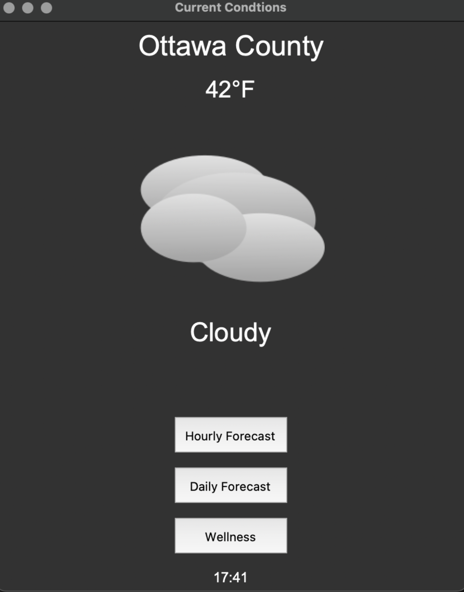
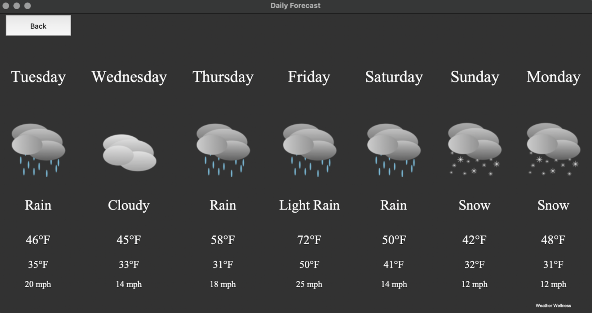
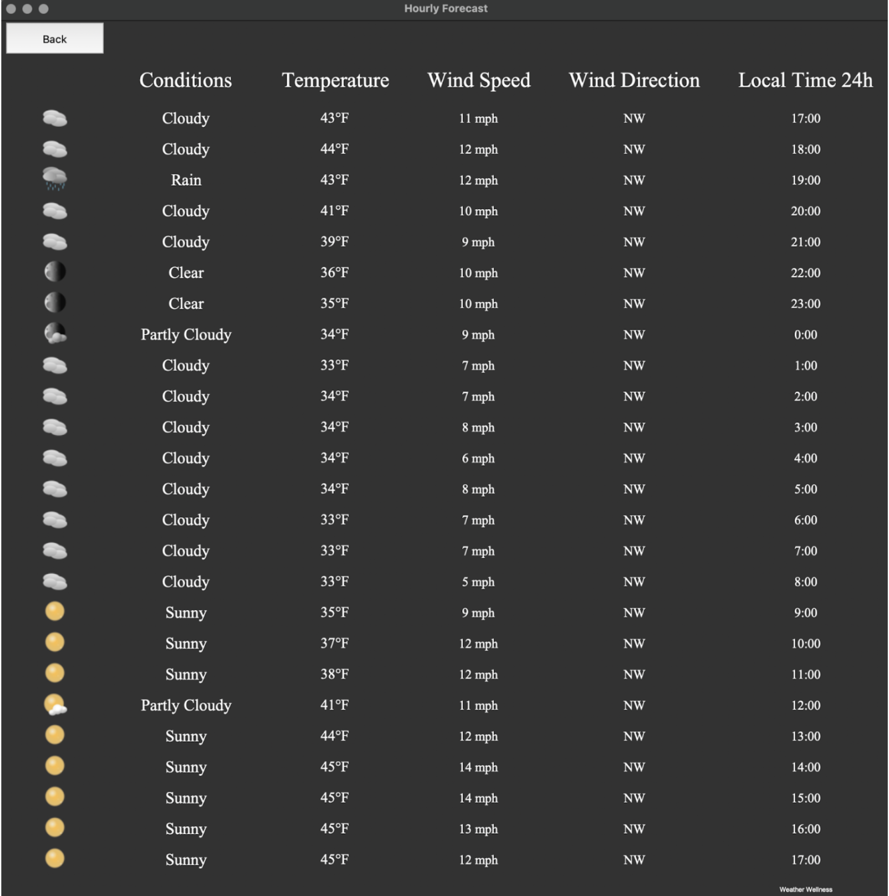
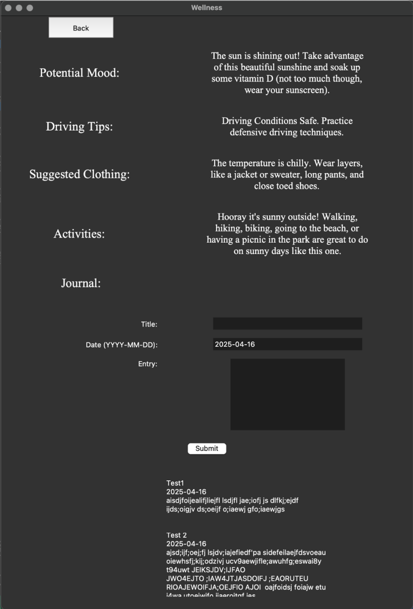

Overview
--------------------------------

This was a group project for CIS350. We created a simple Python weather app using the Open-Meteo Python API and incorporated wellness and recreation tips depending on the current forecast with custom-made weather condition graphics. The idea was to create an app that helped users understand the correlation between weather and how they might feel that day; like how rainy, dreary 

Python APIs Used
---------------------------------
Open-Meteo,
GeoPy,
tkinter,
datetime,
PIL

Application Screenshots
---------------------------------

<b>Main Page:</b> Shows the current weather from the Open-Meteo Python API at the users current location using GeoPy API and gives options to see hourly and daily forecast as well as access the wellness journal.
#

<b>Daily Weather Page:</b> Shows the next 7 days of forecasted weather conditions for the users current location from the Open-Meteo Python API.
#

<b>Hourly Weather Page:</b> Shows the current hour and next 24 hours of weather conditions from the Open-Meteo Python API at the users current location.
#

<b>Wellness Page:</b> Shows tips based on current weather conditions for potential mood, driving, suggested clothing, and activities and allows you to journal how you're currently feeling and add it to your list of previous journal entries.

  
